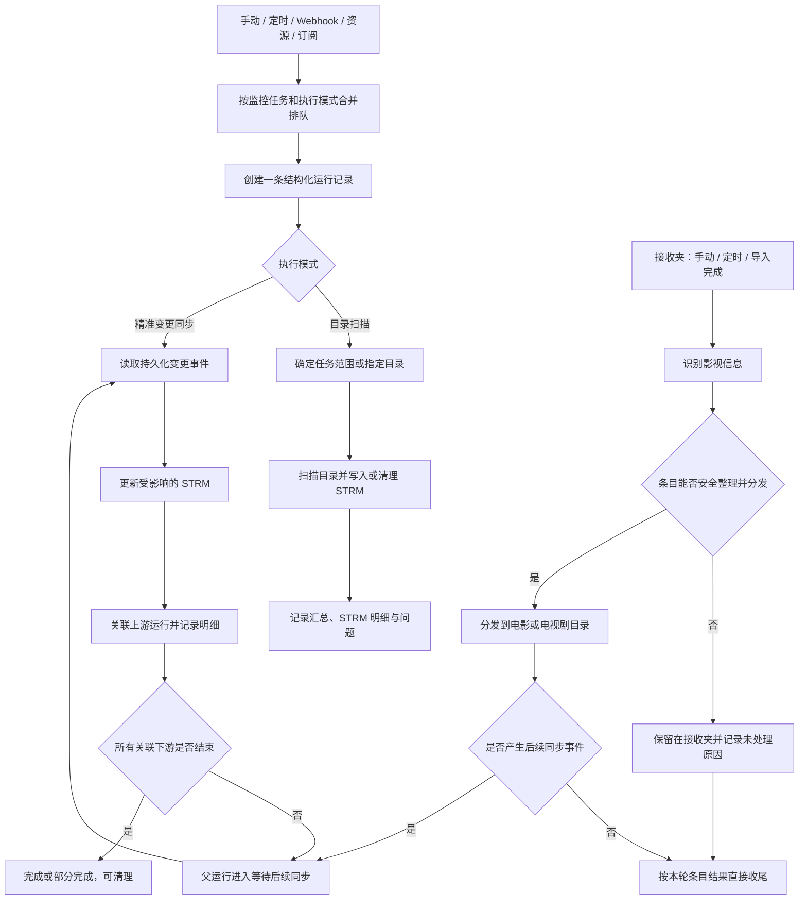

# 文件夹监控运行记录工作流

状态：已实施（2026-09-23）

## 记录规则

- 普通监控的对象名称来自本次实际刷新目录；无指定目录时显示“全部目录”。
- 接收夹在识别前显示“识别中”，识别后显示 TMDB 标题与年份；多部内容显示前两部和总数。
- 队列合并保留所有触发来源。全任务请求覆盖局部请求，多个局部路径保留去重后的并集。
- 接收夹整理、网盘分发和下游 STRM 同步以运行 ID 关联。多个接收夹运行被合并到同一同步任务时，完成结果会回写到每一条父运行。
- 未识别、整理冲突、目标不可用和分发失败都属于已结束的“未处理”条目，不会单独让父运行保持活动；只要本轮产生了下游同步事件，父运行就先等待全部下游结束，再根据未处理条目和下游结果归纳为完成或部分完成。
- 服务启动时会结束上个进程遗留的排队中、执行中记录，并在恢复变更事件后重新归纳等待中的接收夹运行，避免假活动记录长期阻塞清理。
- 新记录只读取结构化表；旧文本日志仅在“历史文本日志”弹窗中查看，不能参与统计或关联。
- 失败或部分完成的普通扫描可从详情中重试原来的全任务或指定目录范围。重试会新建运行记录并以 `retry_of` 关联原记录；精准变更同步不伪造可重试范围。
- 只有仍在监控队列中、尚未派发的运行可从详情取消。取消不会中断已执行扫描，也不会修改网盘、STRM 或索引。

## 保留规则

- 默认长期保留。启用定期清理时，后台每日删除超过保留天数的已结束记录。
- 手动清理先预览数量，再由用户确认执行。
- 运行中、等待下游同步，以及仍被运行中的下游记录关联的记录不会清理。
- 清理只删除运行记录、事件和关联，不修改网盘内容、STRM 文件、索引或待处理队列。
