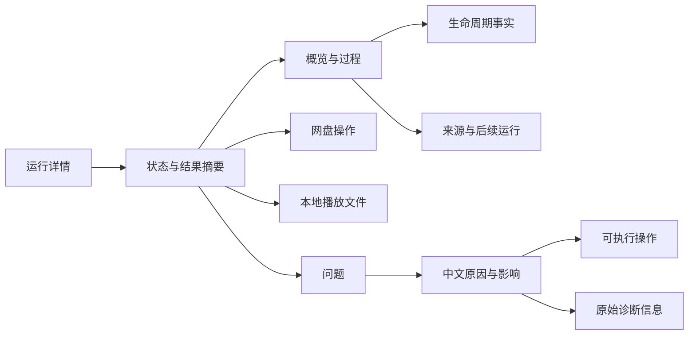

# 文件夹监控运行记录界面整改方案

日期：2026-09-23  
状态：已实施。浏览器验收待补（本地 Docker 与端口绑定均受自动审批服务阻断）。  
范围：文件夹监控任务页底部的运行记录列表、详情弹窗、执行过程、问题诊断及其必要的数据查询支持。

## 1. 目标与边界

用户应当能快速回答：这次是谁触发的、处理了哪里、现在进行到哪一步、实际改变了什么、有没有未完成内容、接下来可以做什么。

整改优先级：先保证状态、计数和操作含义准确，再统一中文表达，最后完善布局、主题与交互。只修改颜色和边距无法解决数据含义不清的问题。

本方案延续现有结构化运行记录，不重建调度器、不更换前端框架、不改变网盘操作、扫描范围、清理或自动整理策略。上方任务配置区和其他页面不在本次范围。旧文本日志保留为诊断入口，不重新解析它来推断新运行状态。

与已有文档的关系：

- `docs/superpowers/specs/2026-09-23-folder-monitor-workflow-design.md`：更大范围的监控工作流设计背景。
- `docs/superpowers/plans/2026-09-23-monitor-run-records.md`：已有运行记录实现的工作流说明。
- 本文：针对目前已形成的运行记录雏形，补充可实施的界面与数据整改方案，不把前两份文档中的远期能力当作已实现能力。

以下问题基于整改前的工作区代码审查。数据查询、中文显示模型、键盘交互、日夜主题与窄屏样式已按本文实施；尚未完成真实浏览器验收，也没有对真实网盘执行验证操作。

## 2. 当前结构与问题清单

### 2.1 现有结构

| 文件 | 当前职责 |
| --- | --- |
| `templates/partials/pages/monitor_about.html` | 列表、筛选、详情标签、保留设置与历史日志弹窗 |
| `static/js/index.js` | 列表及详情渲染、查询、筛选、翻页、重试和取消 |
| `static/js/modules/tabs/monitor.js` | 监控状态更新与页面刷新 |
| `static/js/modules/app/boot.js` | 弹窗背景点击和键盘关闭等事件 |
| `static/css/index.css` | 当前日志样式及日间模式覆盖 |
| `app/routes/monitor.py` | 运行列表、详情、重试、取消和清理接口 |
| `app/services/monitor_runs.py` | 持久化运行、事件、关联与查询 |
| `app/services/quick_import.py` | 接收夹整理结果写入与后续同步等待 |

列表已有每页 10 条、任务/来源/状态筛选；详情已有“概览与过程、网盘操作、STRM 操作、问题与诊断”四个标签。应继续使用这些基础能力。

### 2.2 已确认的问题

P0 表示影响结果正确性；P1 表示影响理解和核心操作；P2 表示视觉、便利性或可访问性完善。

| 优先级 | 问题与代码依据 | 用户影响 | 整改方向 |
| --- | --- | --- | --- |
| P0 | `quick_import.py` 合并结果时，后展开的 `detail` 中 `moved/left` 列表可覆盖同名数量；父运行收尾又将 `left` 转成整数 | 接收夹计数可能缺失，特定数据下父运行收尾可能报错 | 分开存储计数和条目，读取旧记录时兼容归一化 |
| P1 | `monitorRunDetailRows()` 对未映射键直接显示原键；来源、状态也回退到英文值 | 出现 `source_ref`、`queued`、`scope` 等内部字段 | 使用明确的中文显示模型和安全兜底，不直接展示未知键 |
| P1 | 对象使用 `Object.values().join()`，数组直接 `join()` | 出现含义不清的拼接文本或 `[object Object]` | 按字段类型渲染路径、范围、计数和条目列表 |
| P1 | `monitorRunEventCard()` 把历史事件状态当作当前状态 | 整轮已完成，“入队”节点仍像在排队，“开始”节点仍像在执行 | 历史里程碑与当前阶段分开表达 |
| P1 | 概览未传分类，混入逐文件动作和网盘记录 | 时间线被大量文件淹没，难以找到开始、等待与结束 | 概览只承载流程事件，操作明细进入独立分类 |
| P1 | 详情只对运行事件做分页，之后追加全部变更事件；前端没有继续加载入口 | 前 50 条后可能看不到结束事件，网盘记录可能不受页大小限制 | 统一事件查询、排序和分页，再返回分类数量 |
| P1 | 列表统计存在时，用统计替换 `summary` | “有文件生成”掩盖“部分目录失败”等关键信息 | 结果结论与数值分行呈现 |
| P1 | 父运行完成汇总即使为 `partial` 仍使用“下游同步完成”表述 | 状态标签和结论互相矛盾 | 由最终事实生成一致的状态与中文摘要 |
| P1 | 详情子运行与列表关联数量只查 `parent_run_id`，收尾逻辑却同时识别 `downstream` 关联 | 多个来源共享一次同步时，非主来源看不到完整后续过程 | 关联查询统一取并集，并按运行编号去重 |
| P1 | “重试失败范围”实际重跑原运行范围；“取消未开始步骤”实际上只取消尚未派发的队列项 | 按钮让用户误判执行范围和取消能力 | 改为“按原范围重新运行”“取消排队”，展示适用条件 |
| P1 | 状态更新保护了部分非首页数据，但没有完整隔离筛选状态、分页游标与列表请求 | 筛选后的第一页可能被未筛选结果覆盖，后续页游标可能被刷新污染 | 任务状态与运行列表使用独立状态和请求通道 |
| P1 | 详情请求没有响应时序校验，关闭弹窗也不会使旧请求失效 | 快速切换运行或标签时，旧内容覆盖新选择 | 请求序号或取消机制，校验运行编号及分类 |
| P1 | `get_run_detail()` 将事件编号转成字符串排序 | 同秒事件可能出现 1、10、2 的顺序；不同时间格式也可能影响排序 | 使用规范时间和稳定数字序列作为排序键 |
| P2 | 失败与部分完成共用强调色；暗色次要文字较弱；行悬停会改变内边距 | 状态难区分，文字不清晰，悬停时布局晃动 | 语义颜色、可读性核验、固定布局 |
| P2 | 标签具备容器角色但缺少完整键盘行为与选中语义 | 键盘和读屏操作不完整 | 标签键盘导航、焦点管理和局部状态播报 |
| P2 | 翻页失败被空 `catch` 吞掉；详情没有内联重试；任务选项只来自当前任务 | 请求失败无反馈，改名或删除后的历史任务不易筛选 | 明确错误状态，保留查询条件，支持历史任务选项 |

上述问题都属于后续整改内容；本次按要求撤回试改，没有在业务代码中保留修复。

## 3. 方案比较与推荐

| 方案 | 优点 | 局限 |
| --- | --- | --- |
| 仅替换文案与颜色 | 改动少 | 无法修复分页、计数、关联及状态误导，不推荐作为最终方案 |
| **保留现有列表与弹窗，重整显示模型及详情数据，推荐** | 保持使用习惯；从数据和渲染边界解决问题；可分阶段验证 | 需要前后端一起处理显示契约 |
| 重建完整工作流看板或节点画布 | 可表达复杂关系 | 对目前以查看结果为主的场景过重，移动端和维护成本较高 |

推荐第二种：结果在前、过程在后、诊断按需展开。无需新增全屏流程画布，也不把每个文件包装成一个“步骤”。

## 4. 信息架构与布局

### 4.1 底部运行列表

顶部左侧显示“运行记录”和“按最近活动排序”；右侧保留“刷新记录”“记录保留”和翻页。筛选第二行排列，保留任务、来源、状态；有筛选条件时提供“重置筛选”。历史文本日志作为低强调入口放在列表底部。

每条记录分四层：任务与处理对象、来源和时间、中文结果结论、关键数量。右侧只放状态和“查看详情”。不让成功数量覆盖异常结论，不展示一排无意义的零。

示例数字仅用于说明布局：

```text
运行记录                         [刷新记录] [记录保留] [上一页] 第 1 页 [下一页]
按最近活动排序 · 本页 10 条
[全部任务 ▾] [全部来源 ▾] [全部状态 ▾] [重置筛选]

电视剧 · 三体（2023）                                      部分完成
订阅任务 · 09-23 14:26 · 执行 18 秒                         查看详情 ›
1 个目录读取失败；已保留原有文件，本轮未执行过期清理。
本地播放文件：新增或更新 12 · 删除 0           [仅在有意义时显示零值]
────────────────────────────────────────────────────────────────
电影 · 全部目录                                            无变化
定时触发 · 09-23 14:00 · 执行 6 秒
检查完成，没有需要更新的内容。
```

标题最多两行；完整名称可在详情中查看。文件名、影视标题、用户任务名和路径保持原值，包括其中的英文。记录整行可点击，内部不嵌套其他按钮；复制和重试等动作放到详情。

### 4.2 详情弹窗

桌面保留居中弹窗，建议最大宽度约 960～1000 像素、最大高度约视口的 88%。顶部标题和标签保持可见，正文独立滚动。关闭按钮位置稳定。

```text
订阅任务                                                [刷新] [×]
电视剧 · 三体（2023）
开始 2026-09-23 14:26:00 · 结束 14:26:18 · 执行 18 秒

[概览与过程] [网盘操作 2] [本地播放文件 14] [问题 1]

运行结果                                                部分完成
1 个目录读取失败；已保留原有文件，本轮未执行过期清理。
新增或更新 12       删除 2       失败目录 1
本次范围：/115/电视剧/三体（2023）                       [复制路径]
[按原范围重新运行]  将重新检查本次记录中的全部范围。

需要处理：1 个目录读取失败                            [查看问题 ›]
后续运行：电视剧同步 · 已完成                         [查看详情 ›]

执行过程
✓ 已加入队列                14:26:00
✓ 开始检查目录              14:26:01
! 目录检查部分完成          14:26:15    1 个目录读取失败
✓ 本地播放文件同步完成      14:26:17
— 过期清理未执行                       因存在读取失败，已保护现有文件
! 本次运行结束              14:26:18    部分完成
```

只有后端确实记录的阶段和原因才显示。缺少“目录检查完成”等独立事实时，使用已有“开始执行、执行结束”节点；不能从文件数量或时间间隔编造流程。

“概览与过程”完整展示结果、范围、问题入口、关联与时间线；其他标签保留紧凑的运行状态和范围，主体显示对应操作。切换标签不重复堆放整页概览。操作数量与文件数量的单位必须写清。

### 4.3 三类明细

| 标签 | 展示内容 | 默认展开 |
| --- | --- | --- |
| 网盘操作 | 重命名、移动、合并、删除、整理；原位置 → 新位置；已知操作结果及同步状态 | 异常展开；普通条目折叠 |
| 本地播放文件 | 新增或更新、删除、跳过；本地路径、对应网盘路径和原因 | 异常展开；普通条目折叠 |
| 问题 | 发生阶段、对象、原因、影响、已采取措施、可执行操作、原始诊断 | 原因和影响展开；原始诊断折叠 |

目录操作优先显示目录级摘要；只有后端提供明确关联时才聚合文件，不凭路径相似度合并无关事件。原名称已包含在完整路径中时，默认避免重复展示四行相同信息。

## 5. 中文文案规则

### 5.1 统一词表

| 内部值或旧表达 | 默认界面表达 |
| --- | --- |
| `queued / running / waiting` | 排队中 / 执行中 / 等待后续同步 |
| `completed / no_change / partial / failed` | 已完成 / 无变化 / 部分完成 / 失败 |
| `cancelled` | 未开始时为“已取消”；执行后中断为“已中断”；记录不足时采用中性的“已取消或中断” |
| `manual / cron / resource / subscription` | 手动触发 / 定时触发 / 资源导入 / 订阅任务 |
| `webhook / change / auto_rescan / offline` | 外部通知 / 文件变更同步 / 系统补扫 / 离线下载完成 |
| `retry / recovery / system` | 重新运行 / 恢复任务 / 系统触发 |
| `STRM`（说明文案中） | 本地播放文件 |
| `old_path / new_path / scope / source_ref` | 原路径 / 新路径 / 本次范围 / 来源记录 |
| `generated / moved / left / failed_dirs` | 新增或更新 / 已分发 / 留在接收夹 / 失败目录 |
| 接收夹留守、下游任务 | 留在接收夹、后续同步 |

`pending`、`manual_required`、`processing` 等事件状态不能直接套用运行状态词表。例如变更队列的 `pending` 表示“等待同步”，不代表网盘移动尚未发生；`manual_required` 必须结合实际补扫安排说明“等待补扫”或“需要检查”。

### 5.2 翻译边界

1. 应用生成的标题、状态、按钮、字段、提示和数量单位使用中文。
2. 文件名、路径、用户任务名、媒体名称、链接、标识符不翻译，不改变大小写，不替换其内部字符。
3. 原始第三方错误保留原文供排查，放入明确标注的“原始诊断信息”折叠区；上方必须先给出中文摘要。这是保留诊断证据，不是把英文直接充当界面说明。
4. 未知来源显示“其他来源”，未知状态显示“状态待确认”，未知操作显示“操作记录”。不能把未知状态映射成成功。内部值仅在诊断区可见。
5. 不对整个字符串执行 `STRM → 本地播放文件` 或 `Webhook → 外部通知` 的全局替换，因为业务摘要可能嵌有路径。应通过中文模板和独立参数生成说明，保留参数原值。
6. 结构化字段采用允许展示的字段清单。未知字段不进入普通详情；重要的新字段必须补充明确的显示定义。对象和数组必须按类型渲染。

界面说明可使用“本地播放文件用于让媒体库播放网盘中的视频；这些文件通常以 .strm 结尾”，使业余用户理解术语，扩展名仍保留原样。

## 6. 结果和流程的真实语义

### 6.1 结果摘要

- 状态、结论、数量来自同一份结果数据，不能分别猜测。
- `generated` 当前表示“新增或更新”，没有分别记录时不得拆成两个独立计数。
- 远端已分发条目、本地文件变化和问题记录分别计数，不把三者相加成“处理文件总数”。问题数也不等于失败文件数。
- 有问题时优先表达“发生了什么、影响是什么”；“已保留旧文件”“已安排重试”等措辞必须有后端事实支持。
- 零、未记录、不适用是三种不同情况。未记录用“未记录”，不能用 0 冒充；无变化运行使用一句结论，不铺满统计块。
- 接收夹已分发但后续同步仍在执行时，显示“已分发，等待后续同步”，不能提前显示整轮完成。后续失败应使摘要与“部分完成”一致。

### 6.2 流程节点

历史里程碑采用完成时表达：“已加入队列、已合并请求、已开始执行、已进入后续等待”。当前活动阶段另标“正在检查目录”“等待后续同步”。

每个节点包含：阶段名称、事实状态、时间、必要的结果短句和可展开明细。普通成功节点默认收起；失败、受阻节点展开。排队时间与执行时间分开；没有开始时间就不能计算执行耗时。

不提供没有可靠分母的百分比。没有阶段起止时间时，不推算阶段耗时。预期阶段只有在配置或执行器明确说明时显示“未启用、无需执行、受阻”；记录缺失应写“未记录此阶段”，不能解释为跳过。



### 6.3 网盘动作与同步事件必须区分

`monitor_change_events.status` 描述变更同步的处理状态，不能直接标成网盘动作执行结果。移动已发生但本地同步失败时，应展示“网盘移动已记录；本地同步失败”，不要显示“网盘移动失败”。

若网盘真实结果没有保存，只能写“检测到网盘变更”或“已记录网盘变更”，不能补写“移动成功”。问题标签应能包含失败的同步事件，并注明失败发生在同步环节。

## 7. 数据与模块整改设计

### 7.1 职责边界

建议后续将运行记录代码从大型 `index.js` 中提取为三个职责清晰的模块：

- 显示模型：中文词表、字段类型、状态含义和数量单位；不访问页面或发送请求。
- 渲染模块：列表、概览、时间线、问题与关联条目；只根据显示模型生成界面。
- 控制模块：筛选、分页、请求时序、刷新、弹窗和操作状态。

可放在 `static/js/modules/monitor/` 下，沿用项目已有模块加载方式。`index.js` 仅保留必要桥接，`tabs/monitor.js` 推送任务状态而不拥有运行列表查询结果，`boot.js` 只绑定事件。确切文件名在实施计划中确定，避免新建一个同时承担所有职责的大文件。

后端仍使用 `monitor_runs.py`，先抽出结果归一化、关联查询和事件查询函数。不要新建第二套执行状态机。状态和中文文案之间有明确契约，前端不靠识别摘要里的“成功”“失败”来判断状态。

### 7.2 接收夹结果字段

推荐明确区分 `moved_count`、`left_count` 与 `moved_items`、`left_items`。为避免破坏现有消费方，迁移期可同时保留数值类型的 `moved/left` 兼容字段，严禁让列表覆盖计数。

读取历史数据时：若旧 `moved/left` 为列表，复制到条目字段并使用其长度作为兼容计数；若明确计数字段存在则以明确计数为准。历史记录缺失的事实不补造，不为界面整改批量覆盖原始记录。父运行收尾和页面摘要共用同一归一化结果。

### 7.3 统一事件分页

建议详情响应增加：`counts`、`total`、`has_more`、`next_cursor`，继续兼容已有 `run/events/children/links`。分类数量覆盖整个运行，不能等于当前已加载的 50 条。

查询顺序：归一化事件来源 → 根据明确事件关联去重 → 按分类筛选 → 稳定排序 → 分页。普通事件与变更事件不能各自分页后再拼接。建议每页 50 条，最多 100 条；页面显示“已显示 50 / 128 条”“加载更多”，失败时保留已显示内容。

必须明确以下约束：

- 事件身份使用“来源类型 + 源事件编号”；只凭原路径、新路径和操作相同不能去重，因为相同路径可能被多次操作。
- 若现有记录不能明确证明两条是同一动作，应保留来源差异并说明，不静默删掉可能真实存在的动作。
- 时间统一解析或规范存储，不能直接混排带 `T` 和空格的时间字符串；同秒使用数字序列和来源类型稳定排序。
- 首次查询返回分页快照边界；后续页在同一边界内加载，新增事件显示“有新记录”。建议采用游标；过渡期保留 `offset` 时，也要固定边界，禁止分页间插入引发重复或遗漏。
- 汇总结果直接读取运行记录，不依赖是否加载到最后一条结束事件；概览仍必须能完整加载所有流程节点。

### 7.4 关联运行

父子查询同时包含直接 `parent_run_id` 和 `downstream` 关联，按运行编号去重。列表的关联数量与详情使用相同查询口径。

详情区分“来源运行、后续同步、原运行记录”，其中原运行通过 `retry_of` 定位。支持从关系条目打开对应详情，并提供“返回上一条运行”导航；保存原标签、滚动位置和焦点，避免查看子运行后丢失上下文。

共享同步明确标注“多个来源共用此同步”，不把它重复算成多个实际操作。记录被清理时显示“关联记录已清理”，避免空白或死链接。

## 8. 筛选、翻页与实时刷新

1. 运行列表拥有独立的筛选条件、页码、分页游标、加载状态及请求序号。任务卡片的状态轮询不能替换它们。
2. 改变筛选条件回到第一页，清空旧游标；筛选选项包括已有历史任务，保留当前选中值。未匹配时显示“没有符合条件的记录”，与“尚无运行记录”区分。
3. 默认列表按最近活动排序。由于 `updated_at` 会变化，分页过程中采用固定快照或缓存已访问页；刷新后才建立新的排序和游标。不能承诺实时变化的游标列表永不漏项。
4. 用户浏览历史页时保留位置，顶部显示“有新记录”；点击后进入最新第一页。页面主动“刷新记录”重新查询当前筛选的第一页。
5. 运行中详情可每 5 秒刷新轻量摘要；完整事件只在概览处于最新位置时增量更新，否则提示有新记录。已结束运行停止轮询；页面隐藏、详情关闭或切换运行时取消计时器。
6. 所有响应必须匹配请求序号、运行编号和分类；旧响应直接丢弃。取消请求只是减少资源消耗，不能替代响应校验。
7. 刷新保留已展开条目、键盘焦点和滚动位置。追加分页失败时只显示内联重试，不清空已有内容。
8. 初次加载、加载失败、空数据、无匹配、关联已清理分别提供中文提示。失败后提供“重新加载”，禁止空 `catch` 吞掉错误。

## 9. 问题诊断与操作

每条问题默认按“阶段 → 对象 → 中文原因 → 实际影响 → 已采取措施 → 下一步”排列。原因不确定时写“暂时无法确认原因”，不把所有英文错误都解释成网络问题。凭错误代码、HTTP 状态及已知异常类型映射；原文始终可展开。

| 操作 | 出现条件 | 文案与结果 |
| --- | --- | --- |
| 按原范围重新运行 | 原记录为失败/部分完成的普通扫描，任务仍存在且范围可恢复 | 提示“会重新检查本次记录中的全部范围”；成功后打开新记录，并可返回原记录 |
| 取消排队 | 后端确认同一运行仍在队列、尚未派发 | 说明仅取消本次尚未开始的运行；若已开始，刷新状态并提示无法取消 |
| 查看后续同步 | 存在可查询的后续运行 | 打开关联详情，不重新触发任何执行 |
| 复制路径/诊断 | 有相应内容 | 路径复制原值；诊断复制前剔除访问令牌等敏感字段 |

前端显示条件只是辅助，接口必须重新检查当前状态。提交期间禁用重复点击，失败时恢复按钮并给出可理解的原因。

本轮不提供“仅重试失败范围”，因为当前接口没有可靠的失败子集执行能力；若未来实现，应先明确失败目录/事件身份和幂等边界，再增加独立按钮，不能只改标签。也不在运行记录里新增取消已执行网盘动作的能力。

旧文本日志按原文显示，标注“历史诊断记录”，不做破坏证据的自动翻译。保留设置继续说明只清理记录，不删除网盘和本地播放文件；预览数量后再确认清理，正在运行及被活动运行依赖的记录继续保护。

## 10. 日夜模式、窄屏和可访问性

### 10.1 视觉规格

- 使用项目现有主题变量，并为记录区定义正文、次要文字、分隔线、浅底、成功、活动、警告、失败等语义变量；避免为每条规则再追加一套覆盖样式。
- 正文建议 14 像素、行高 1.5～1.7；次要说明不小于 12 像素。标题 16～18 像素，数量强调适度，所有数字使用等宽数字样式。
- 已完成使用绿色，执行中使用蓝色，部分完成使用琥珀色，失败使用红色，取消/未执行使用中性灰；每个状态都有文字或图标，不仅靠颜色。
- 普通文字对比度至少 4.5:1，控件边界、焦点等关键非文本元素至少 3:1；日间与夜间分别测量，不能把低透明度暗色文字直接复用到浅色背景。
- 悬停只改变背景或边框，不改变内边距和宽度。减少卡片套卡片，用标题、留白和细分隔线表达层次。

### 10.2 窄屏

在 640 像素以下改为纵向布局，弹窗接近全屏并考虑安全区域。任务筛选单独一行，来源与状态可并排；分页操作允许换行。标签可横向滚动，正文不得产生页面级横向滚动。

路径使用 `overflow-wrap: anywhere`，保留完整复制入口；详情键值对上下排列。建议触控区域至少 44 × 44 像素。长任务名、英文文件名、连续无空格路径、嵌套对象都作为必须验证的样例。

### 10.3 键盘与读屏

弹窗打开后焦点进入标题或关闭按钮；Tab 在弹窗内循环；Escape 关闭当前最上层弹窗；关闭后返回原触发记录，触发项已不存在时返回列表标题。

标签具有 `tablist/tab/tabpanel`、`aria-selected` 和关联标识；左右方向键、Home、End 可切换。加载区域使用 `aria-busy`；只对状态摘要和错误做适量播报，避免每次轮询朗读整个列表。所有按钮有清晰的焦点样式。

## 11. 分阶段实施顺序

本文为方案，不表示下列任务已经完成。

| 阶段 | 工作 | 主要文件/范围 | 完成条件 |
| --- | --- | --- | --- |
| 一：数据真实性 | 计数与明细分离、历史兼容、父运行结论一致、关联并集与去重、同步状态语义 | `monitor_runs.py`、`quick_import.py`、`tests/test_monitor_runs.py` | 结果计数、父子状态及关联数量符合事实 |
| 二：查询契约 | 统一事件分页、分类计数、稳定排序、运行不存在/已清理响应 | `monitor_runs.py`、`routes/monitor.py`、相关接口测试 | 大量事件不截断、不重复，分类统计完整 |
| 三：中文与结构 | 提取显示模型和渲染模块、词表、字段类型、结果摘要、时间线与三类明细 | 监控前端模块、`index.js`、监控模板 | 常规界面不泄漏英文内部值，不扁平化对象 |
| 四：交互闭环 | 独立列表状态、请求时序、轮询释放、加载更多、关系导航、准确按钮文案 | 监控控制模块、`tabs/monitor.js`、`boot.js` | 快速切换和自动刷新不覆盖用户选择 |
| 五：视觉与验收 | 主题变量、窄屏、焦点与读屏、真实页面复核 | CSS、模板、浏览器验证 | 两种主题及常用宽度均可读可操作 |

每阶段保留兼容入口并独立验证，不同时重写监控执行器和日志界面。遇到缺失的执行事实，优先补充必要的结构化事件；无法可靠获取的字段明确标为未记录。

## 12. 验收清单

### 12.1 行为场景

| 场景 | 必须满足 |
| --- | --- |
| 正常扫描 | 中文来源/状态；准确范围和实际结果；历史入队节点不显示成当前排队 |
| 无变化 | 一句明确结论；不编造新增/更新拆分；不堆放零值 |
| 部分目录失败 | 列表保留失败摘要；保护措施只有确实执行才显示；可按原范围重新运行 |
| 接收夹有待处理条目 | 列表与详情数量正确；原条目可读；父运行等待/收尾不因列表转整数而报错 |
| 后续同步失败 | 网盘动作与同步结果分别表达；父运行不出现绿色成功摘要 |
| 多来源共用一个后续运行 | 每个来源都能看到该运行；数量不重复；可往返导航 |
| 超过 50 条事件、同秒多条事件 | 可加载全部事件；顺序稳定；结束事件可见；不同来源都受分页限制 |
| 名称含英文、引号或尖括号 | 原值可读可复制；不被翻译；不会被当成 HTML 或执行代码 |
| 快速切换运行/分类、关闭后响应返回 | 仅当前有效请求可更新页面，关闭后不重新打开弹窗 |
| 筛选后轮询、历史页出现新记录 | 筛选值、列表内容、页码和游标不被任务状态覆盖 |
| 网络请求失败 | 保留已有数据与查询条件，中文提示，能够重新加载 |
| 任务删除、改名或记录清理 | 历史快照仍可读；重跑不可用时有原因；关联失效有解释 |
| 取消和派发同时发生 | 服务端裁决；不会显示实际未成功的取消结果 |
| 日夜主题、390/768/1440 像素宽度 | 文字可读，长路径可换行，无页面溢出，焦点和触控入口可用 |

### 12.2 后续实施验证方法

- 后端在 `tests/` 维护真实行为测试：计数兼容、父子运行收尾、共享关联、分类分页和同秒排序；使用临时数据库，不触碰真实网盘。
- 前端验证渲染输出和用户行为：中文显示模型、对象渲染、迟到响应、筛选刷新、分页失败恢复与键盘操作。不要只检查源码是否含某个字符串。
- 使用项目 `.venv/bin/python` 运行相关 `unittest`；对改动 Python 做语法验证、对改动 JavaScript 做 `node --check`，并运行 `git diff --check`。
- 通过 Docker 验证时先依项目 `AGENTS.md` 重建当前镜像，再验证页面，避免拿旧页面验收新方案。截图等验证产物保存在临时目录。
- 浏览器使用模拟或安全的既有记录检查正常、无变化、失败、等待、取消和超长明细；真实网盘操作不是界面验收的默认步骤。

交付判定：中文表达完整、结果与事实一致、流程能解释当前状态、全部明细可查、用户选择不被刷新打断，且两种主题和窄屏下均能操作。仅“页面看起来更整齐”不构成完成。
