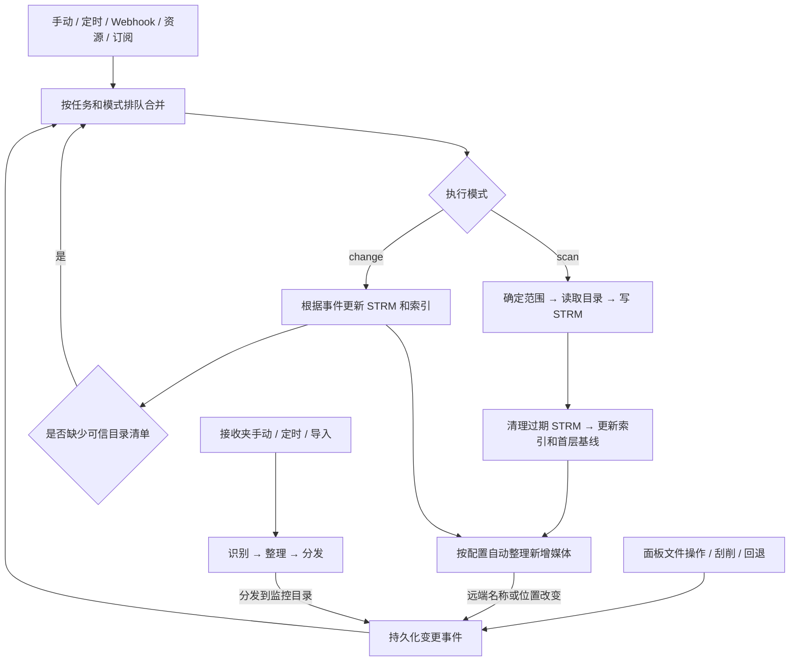

# 文件夹监控工作流与运行结果优化设计

日期：2026-09-23

状态：设计草案，供讨论；未修改业务代码，未批准实施

核对基线：本地 `main`，`38d7899`，`version.json` 为 `0.11.10`

## 1. 目标与设计范围

用户应能从一条运行记录回答五个问题：为什么运行、处理哪里、实际改变什么、哪些没有完成、下一步怎么办。需要排障时，再展开步骤、来源和原始诊断信息。

推荐统一目录扫描、变更同步、接收夹整理的运行结果展示，保留它们各自的执行职责。接收夹先按一并纳入设计处理，范围可在评审时收窄。改造涉及结果模型、触发范围和交互，不扩大到重写下载、订阅或刮削引擎，也不新增 115 行为事件订阅。

## 2. 当前可以由哪些入口触发

当前目录扫描实际只支持 115。其他网盘的导入成功不能据此认定会生成 STRM。普通保存路径匹配会选覆盖路径最深的扫描任务；精准变更则会通知所有覆盖旧路径或新路径的扫描任务。接收夹被排除在这两种匹配之外。

| 用户可见来源 | 当前调用与时机 | 当前更新范围 | 当前显示的触发类型 |
| --- | --- | --- | --- |
| 监控卡片“运行”、CLI 对应入口 | `/monitor/start` | 默认任务根目录；仍遵循首层时间跳过配置 | 手动触发 |
| 刮削页“扫描监控 / 刷新 STRM” | `/monitor/scan` → `queue_monitor_dir_scan` | 所选目录，按任务分组；每次最多 50 个；强制进入这些子树 | 手动触发 |
| 资源中心的 115 分享转存 | 完成提交、经过配置延时后；也可从资源任务手动触发刷新 | 优先 `savepath/sharetitle`，单文件或混合内容用 `savepath` | 资源中心触发 |
| 普通监控目录中的磁力 / ED2K 导入 | 轮询匹配离线任务的哈希或 URL，并校验保存目录；确认 `status=2` 后触发 | 能识别下载文件夹则进入该文件夹，否则使用保存目录 | 资源中心触发 |
| 订阅任务的分享导入、批次收尾 | 成功资源按“监控任务 + 保存目录”分组提交；另有历史待刷新收口 | 分组保存目录 | 资源中心触发 |
| 订阅“扫描链接”的磁力 / ED2K | 离线完成 → 挑选命中文件 → 移动到订阅目录后 | 实际移动到的保存目录 | 资源中心触发 |
| 普通 Webhook | `/webhook/{task_name}`，非磁力请求通过任务与鉴权校验后 | 有有效路径时局部刷新；不带路径时按任务根目录刷新 | Webhook 触发 |
| Webhook 提交磁力 | 先创建资源导入任务，再沿资源流程处理 | 普通监控目标同离线导入；接收夹目标走整理流程 | 后续可能显示资源中心触发 |
| 面板内新建、复制、移动、重命名、删除，以及刮削执行 / 回退 | 操作前记录变更事件，操作后确认，交给 `monitor_changes` | 优先根据文件 ID、旧新路径和已有索引更新本地 STRM；需要时读取受影响目录 | 刮削变更同步 |
| 未知目录清单的后续补扫 | 变更同步安排 `queue_monitor_dir_scan` | 缺失清单的受影响目录 | **手动触发**，实际是自动补扫 |
| 定时运行 | `startup.monitor_scheduler` 每 5 秒检查到期任务 | 任务根目录；可跳过时间未变化的首层文件夹 | 定时触发 |
| 变更恢复 / 重试 | 启动恢复持久化事件，调度器重新提交就绪事件 | 原事件范围 | 刮削变更同步 |

边界说明：

- 停用的扫描任务拒绝非 `manual` 自动入队，手动运行仍允许。补扫当前复用了 `manual`，因此来源和“停用后不自动运行”的策略没有完全分开。
- 有未完成的普通离线导入时，相关任务的定时扫描顺延。重复离线提交、失败或超时不等同于已确认下载完成。
- 未发现已接入运行代码的 115 行为事件监听。直接在 115 客户端改目录，需要靠后续扫描或外部 Webhook 发现；现有行为事件文档属于设计资料。
- 目录树任务有自己的生成流程，当前调用点中没有把它作为监控刷新来源。
- 接收夹卡片的“运行”实际执行识别、整理和分发；它使用独立锁和 `quick_import_runs`。手动、定时、导入及离线完成处理都有入口。
- 接收夹离线链路存在需要优先验证的边界：`run_resource_job` 在 `quick_import_inbox` 分支提交后就调度整理，而离线 watcher 只选取 `submitted` 任务；没有绑定监控任务时通用状态分支会写 `completed`。因此不能把接收夹链路概括为“当前总能等待下载完成”。这是静态发现，尚未做真实下载复现。

## 3. 当前如何执行



### 3.1 排队和合并

普通扫描与变更同步共用一个串行队列；同一任务的 `scan` 和 `change` 分开排队。同一任务、同一模式的等待项会合并；正在执行的项不在该等待列表里，新触发可排到下一轮。接收夹使用独立执行锁，可以与监控并行。

当前合并逻辑有多套范围表示：`savepath`、`sharetitle`、`savepaths`、空载荷。同时又用 `trigger` 决定如何解释这些字段。两个单路径请求可能提升到父目录或全任务；多个路径超过上限也回退全任务。合并只留下一个优先级最高的触发类型，不能完整保留每一次请求来源。

### 3.2 目录扫描

1. 校验任务、115 认证、扫描路径和 STRM 地址；按配置等待延时。
2. 决定起始目录。局部刷新先读取父目录，缓解 115 新目录短暂不可见的问题。
3. 从任务根目录运行时，总会读取根目录；“目录时间检查”只比较第一层文件夹。时间相同、无脏标记、没有强制要求时，沿用已有索引并跳过整个分支。
4. 进入一个需要扫描的分支后递归读取其子目录，不继续用深层时间剪枝。局部指定目录刷新会绕过首层跳过。
5. 按媒体扩展名和大小过滤文件，生成播放地址。默认内容相同就不重写 STRM；“全量重写 STRM”仅决定写入策略，并不自动取消目录跳过。
6. 开启清理且本次没有目录读取失败时，删除本次扫描范围内索引已经记录、但本次未出现的 STRM；局部扫描的清理边界也是局部。不会把所有非受管文件一起删除。
7. 有目录读取失败时保留原有索引的未覆盖部分，跳过本轮过期清理；全部目录读取失败则整轮失败。目录脏标记支持下次补扫，消失目录记录需连续两次确认后释放。
8. 更新文件索引和首层时间基线。开启自动整理时，对新增媒体调用共享的识别 / 整理流程；整理产生的远端变更再进入事件同步。
9. 输出汇总和通知，释放队列，运行下一项。

“首层时间检查”不能保证发现所有深层变化；深层变化没有反映到第一层文件夹时间时会漏过。现在需要关闭该开关再手动运行，才能确保完整递归检查。新设计应提供一次性的“完整校验”入口。

### 3.3 变更同步

- 对可确认的单文件或可信目录清单，直接更新受影响的 STRM 和索引，通常不遍历监控根目录。
- 不确定远端操作结果时，按受影响目录 CID 做局部核对；未知 / 不完整目录清单会形成待补扫范围。
- 一次事件失败会回滚本地 STRM 操作；普通临时错误采用退避重试，通常最多三次。确定性错误和已确认刮削任务的一次性同步错误可能直接结束并删除事件；本地回滚失败会保留事件，不能把它当作普通成功。
- 汇总计算批次内 STRM 的净变化，中间生成后又删除的路径会抵消。
- `scraper-job:` 来源跳过二次自动整理，避免整理动作不断触发新的整理。
- 开启 / 关闭“清理过期 STRM”控制扫描比对清理；明确删除、移动等变更同步有独立语义，不能把该开关理解成禁止所有 STRM 删除。

### 3.4 接收夹

接收夹的定位是**分类前的中转文件夹**，属于新增的**便捷入口**，不是强制流程：电影 / 电视剧各自有监控目录，用户以前保存或推送前必须先挑分类，现在也可以先统一丢进接收夹，归到哪一类由识别结果和分发目标决定；原来的"直接推送到分类监控目录"用法继续有效，两者可以并存。它同样支持油猴脚本推送离线链接，鉴权与普通监控任务**共用同一个全局 `webhook_secret`**（没有按任务拆分的密钥），只是接收之后的处理流程不同。

识别媒体 → 按目标任务的规则整理 → 分发到电影 / 剧集目录 → 变更事件同步 STRM。低置信度、重名冲突、目标不可用、搬运失败的条目留在接收夹并记录原因。目标已有媒体文件夹时复用并合并。取消在条目边界生效，已完成的远端操作不会自动撤销。

接收夹“分发完成”和目标目录“STRM 同步完成”是不同时间点，目前没有统一运行链路把它们串成一个最终结果。

## 4. 当前日志会怎样显示

以下为按当前模板组合的示例，不是用户真实运行数据。

### 普通扫描

```text
09-23 14:26:00 ━━━━━━━━━━【任务开始 | 电视剧 | 资源中心触发】━━━━━━━━━━
扫描: /115/电视剧 | 输出: /strm/电视剧
写入: 增量生成/更新 STRM | 清理过期 STRM: 开启 | 目录时间检查: 开启
资源导入: 内容: 示例剧 | 目录: 示例剧 | 类型: folder
资源导入 定位刷新目录: /115/电视剧/示例剧
范围: /115/电视剧/示例剧
资源导入 预刷新父目录: /115/电视剧
·· 扫描生成 ··
读取目录: /115/电视剧/示例剧
生成: /app/strm/电视剧/示例剧/E01.mkv.strm
……逐目录读取、逐文件生成……
·· 清理校正 ··
清理范围: /115/电视剧/示例剧
·· 执行结果 ··
生成汇总: 新增/更新 12 | 跳过文件 3 | 跳过目录 0 | 失败目录 0
首层汇总: 深扫分支 0 | 跳过文件夹 0 | 待补扫分支 0
清理汇总: 清理过期 STRM 开启 | 删除 STRM 0 | 删除空目录 0
结论: 新增/更新 12 | 跳过 3 | 自动整理 已执行 | 清理 0
━━━━━━━━━━【任务结束 | 电视剧 | 执行成功】━━━━━━━━━━
```

实际每行均带时间。上例“自动整理 已执行”甚至可能在未整理时出现：执行器默认传入 `"-"`，结论函数将非空文本判定为已执行。

### 精准变更和自动补扫

```text
━━━━━━━━━━【任务开始 | 电视剧 | 刮削变更同步】━━━━━━━━━━
……同样输出扫描路径、写入和清理配置……
·· 处理刮削变更 ··
文件夹变更: 电视剧/旧名称 -> 电视剧/新名称（删除 24，生成 24）
变更同步汇总: 事件 1（完成 1 / 失败 0 / 丢弃 0） | 生成 STRM 24 | 删除 STRM 24 | 局部读取目录 0
━━━━━━━━━━【任务结束 | 电视剧 | 变更同步完成】━━━━━━━━━━
```

缺少目录清单时追加“需补扫”“已自动安排补扫目录”，后续扫描会成为另一个标记“手动触发”的分段。单文件变更输出成对的删除 / 生成行；文件夹操作显示目录映射和数量。

接收夹使用相同起止分隔行，中间主要是“已整理分发 N 项，留在接收夹 M 项”；详细留守原因另存于 `quick_import_runs.detail_json`。

前端默认取最近 3 个任务分段，并提供“加载更早 3 条”。但是渲染时 `flatMap` 将分段重新摊平成连续文本，更新后滚动到底部。文本落在轮转日志文件中；分段、状态和颜色依赖中文内容及分隔符解析。

## 5. 根本问题和本次证据

| 问题 | 当前证据 | 用户影响 |
| --- | --- | --- |
| 来源混淆与丢失 | 自动补扫调用 `manual`；订阅调用 `resource`；不同订阅运行合并后来源上下文为空 | 不知道是谁触发，无法返回原任务 |
| 范围由触发标签决定 | 多目录合并得到 `savepaths`，触发升级为 `resource` 后该分支只按单路径解析 | 原本只刷新两处目录，实际可能回退全任务 |
| 合并可能漏掉更大请求 | 空载荷代表任务范围，与 `savepaths` 合并后仅剩局部列表 | 用户要求的完整任务检查可能被收窄 |
| 成功口径不准确 | 扫描局部读取失败或整理异常后仍可输出“执行成功”；变更丢弃数不参与最终失败判断 | 绿色完成掩盖未完成内容 |
| 整理统计不可信 | 默认 `"-"` 输出“已执行”；整理函数按计划 `ready_count` 报成功，未读取刮削最终状态 | 计划执行数被当作实际成功数 |
| 并发日志串段 | 接收夹独立锁；日志解析器只有一个当前分段，不校验结束行所属任务 | 接收夹可能包含另一个任务的扫描和结束记录 |
| 等待与完成混在一起 | 导入任务在监控入队时就写 completed；补扫、后续变更是新的运行 | 上游完成但 STRM 还未完成，用户看不到接力关系 |
| 恢复概念不一致 | 内部 `manual_required` 已自动排队，但卡片仍写“需手动监控” | 用户重复点扫描或以为必须处理 |
| 信息需要人工拼接 | 新增和更新合并；过滤、未变化和越界跳过都进入 skipped；清理汇总只说开关开启 | 无法快速理解“没处理”的真实原因 |
| 历史排障脆弱 | 一些失败事件直接删除，原始日志轮转；没有通用持久化运行 ID | 事件失败原因和后续恢复难以关联 |

本次已执行：253 项现有监控、精准同步、离线完成与接收夹测试全部通过。另以当前纯函数复现上述默认整理结论、混合触发范围、全任务范围收窄、订阅来源丢失、并发串段五类问题。现有测试通过不代表这些新增边界已经覆盖。其他问题为逐分支代码核对，未操作真实网盘。

## 6. 方案比较

| 方案 | 内容 | 代价与限制 |
| --- | --- | --- |
| 只调整日志样式 | 折叠、颜色、摘要卡 | 改动小，但继续依赖文本推断，无法解决来源、范围和状态失真 |
| **统一运行记录 + 统一刷新请求，推荐** | 持久化结构化结果，规范范围和来源，复用现有执行器 | 工作量适中，能从根源解决本次问题，并保持功能边界 |
| 重建整个媒体自动化引擎 | 下载、订阅、整理、监控全部换调度模型 | 范围过大，迁移风险高，本轮收益不匹配 |

## 7. 推荐交互

### 7.1 页面结构

保留上方任务列表。卡片明确标注“目录同步”或“接收夹整理”，显示当前阶段、最近一次结果、待处理问题数和下一次自动检查时间。

底部“监控日志”改为“运行记录”。默认按最近活动排序，每次逻辑工作显示一条摘要；可按任务、来源、时间和有无问题筛选。后续补扫归入原记录的执行过程，不能无解释地再冒出一个“手动任务”。确实合并执行时列出所有来源及合并范围。

一条记录默认呈现：

```text
电视剧 · 部分完成                         14:26 · 执行 18 秒
来源：订阅《示例剧》 · 本次更新 1 个目录
/115/电视剧/示例剧
新增 STRM 12 · 更新 2 · 未变化 38
1 个目录读取失败；已保护现有文件，本轮未清理
[仅重试失败目录]  [查看详情]
```

数字都是演示值。无变化记录只显示“检查完成，没有需要更新的内容”，不铺满 0。有问题的记录默认直接显示影响和恢复操作。对未实际读取的分支使用“沿用已有索引”，不能把其中所有文件冒充“已确认未变化”。

### 7.2 详情的三层内容

1. **结果**：实际新增、更新、移除的 STRM；远端整理 / 分发另外计数。显示本次范围和清理是否执行及原因。
2. **执行过程**：按需要出现的阶段展示时间线，包含排队、等待下载、检查目录、同步 STRM、整理、整理后同步、清理和通知。没有运行的阶段明确写未启用、无需执行或受阻；不显示虚假的百分比。
3. **诊断信息**：发生时间、路径、错误码和原始错误、尝试次数、下一次重试时间、保护措施、来源任务、关联运行和原始日志。支持复制 / 导出经过脱敏的诊断包。

目录变更使用“旧路径 → 新路径，24 个 STRM 已迁移”的业务表达。删除 / 重建的具体动作留在展开明细，目录操作按目录聚合；需要核对单文件时按需分页查看。

桌面和手机共享同一信息层级；小屏纵向堆叠，路径可换行和复制。日夜模式均提供可读的中性色文本，状态同时用文字表达。浏览旧记录时不被新日志强制拉到底部；提示“有新记录”并由用户选择返回。

### 7.3 操作与配置收口

- **立即检查**：按现有自动检查策略检查任务，允许跳过首层未变化分支。
- **完整校验**：本次递归读取全部范围，绕过时间跳过；不要求用户临时改配置。
- **同步指定目录**：从文件浏览选择目录，只处理这些目录。
- **重新写入 STRM**：高级操作，独立于扫描范围；说明会重写已存在的输出。
- **仅重试失败范围**：重新核对失败目录 / 事件，保留与原运行的关联。按钮按错误类型出现，失效认证先引导修复配置，不能无条件重试远端移动。
- **启用自动运行**：明确只控制自动触发；手动操作可用。自动补扫保留自动来源；停用后尚未开始的自动后续步骤标记暂停原因。

主要设置显示任务名、网盘目录、STRM 输出、自动检查频率和是否整理。首层时间策略、写入策略、大小过滤、重试和节流进入高级设置，附带一句能解释实际效果的说明。保留现有用户配置，迁移不暗改清理或整理开关。

## 8. 支撑交互的逻辑设计

### 8.1 三个独立概念

**任务配置**决定管理哪个目录及其策略；**刷新请求**说明谁要求处理哪些内容；**一次运行**记录该请求执行后的事实。来源不再参与范围字段的解释。

统一请求字段包括 `task_id`、`source`、`source_ref`、`scope`、`scan_strategy`、`write_policy`、`parent_run_id`、`dedupe_key`。其中：

- `source` 区分用户、定时、资源导入、订阅、Webhook、刮削、接收夹、自动补扫和恢复。
- `source_ref` 保存来源任务 ID / 运行 ID，来自用户的标题仅用于展示。
- `scope` 明确为 `task`、`paths` 或 `events`。入队前完成路径归一化、任务边界校验和 folder/file 类型解释。
- `scan_strategy` 区分自动检查和完整校验；`write_policy` 区分按需写入和强制重写。
- 任务保存不可变 ID；历史运行保存任务名、路径和关键配置快照，改名或删任务后仍可追溯。

合并规则：任务范围覆盖局部范围；完整校验优先于时间跳过；局部路径取并集并去掉被父路径覆盖的子路径；不同分支不得无提示扩大为全任务。超过每批 50 条时拆成关联批次，不能截断或通过空载荷悄悄变更范围。全部来源作为独立事件保留，不以最后一个触发类型覆盖。

有效的旧 Webhook 请求不带路径时继续表示全任务，运行记录明确标注原因。传入无效 / 越界的指定路径返回可解释错误，不把输入错误当作全任务命令。自动触发是否允许，在入队和实际开始时均校验；手动意图不从来源文案猜测。

### 8.2 结构化记录，文本日志作为输出之一

使用现有 SQLite，不引入消息中间件。建议增加三个小表：

| 表 | 职责 |
| --- | --- |
| `monitor_runs` | 任务和配置快照、生命周期、汇总结果、主要范围、开始结束时间；队列项持有其 ID |
| `monitor_run_events` | 按序追加来源、阶段变化、范围决策、已提交效果、问题、恢复操作和诊断文本；按运行分页 |
| `monitor_run_links` | 表达来源对象、父子运行、合并运行和重试关系，支持多个来源共享一次执行 |

复用 `monitor_change_events` 的可重试事件与 STRM 事务保护；复用 `quick_import_runs` 和刮削任务作为执行数据来源。运行记录是统一查询层，不复制它们的执行状态机。执行器报告结构化事实，由一处结果归纳器计算状态和文案；页面不再用正则从“成功”等中文词推断状态。

网络响应和异常中的认证信息、Cookie、带令牌 URL 不进入诊断包。文件 / 目录的正常读取和未变化动作默认聚合计数；实际变更及错误保留明细，按需加载，避免在 SSE 中发送全部文件列表。

### 8.3 结果状态必须诚实

生命周期区分排队、执行中、等待后续步骤和结束；“等待重试 / 等待补扫”是尚未完成，不显示绿色成功。结束结果如下：

| 展示 | 判定 |
| --- | --- |
| 已完成 | 本次要求的必要步骤及其后续同步全部成功 |
| 无变化 | 完成所要求检查，没有实际变化；允许明确说明沿用索引的分支 |
| 部分完成 | 一部分内容成功，另一部分读取、整理、同步或分发失败 |
| 待处理 | 识别待确认、冲突、不可自动恢复等，需要用户选择动作 |
| 失败 | 必要步骤失败且未完成有效目标，或配置不满足 |
| 已中断 | 用户停止，说明已完成与未完成范围；已产生效果不假装回滚 |
| 服务重启中断 | 运行状态未正常收尾，保留最后阶段与恢复入口 |

通知失败作为附加警告，不否定已经完成的文件同步；可显示“已完成 · 通知未送达”。未启用、无候选、未匹配到高置信度、整理成功、整理失败必须是不同的阶段结果，不能都转成“已执行”。

整理结果读取真实刮削任务的 `completed / partial / failed` 及实际成功数量，不能使用计划 `ready_count` 作为完成数量。失败事件退出执行队列前先保存不可变的失败摘要和范围，防止“清掉重试”同时清掉追溯证据。

### 8.4 后续任务与计数

“订阅导入 → 监控扫描 → 自动整理 → 变更同步 → 必要补扫”保持同一工作链的关联。每个执行仍有独立 run ID；上层记录等待必要的后续步骤达到终态后再给出整体结果。下载任务可显示“文件已入盘”，监控未完成时同时显示“STRM 同步中”。

合并运行可以有多个来源。展示“与另外 2 次请求合并执行，共更新 14 个 STRM”，不能把共同结果重复算给每个来源后再求和。各类指标使用提交后的净效果；回滚动作不作为新增成果。新增、内容更新、强制重写、删除、内容未变、过滤跳过、索引复用分别统计，不能从未知数据估算。

初期保留现有扫描 / 变更串行执行和接收夹独立锁，先修正可观察性与范围合同。并发日志按 run ID 归属，互不串段。自动整理引发的同步仅处理文件变化，保留防止重复整理的规则。

### 8.5 可靠性与兼容

- 已接受的刷新请求及来源先落库，再入内存调度。服务重启后未开始的本地同步请求可恢复，执行中的运行标记中断并从现有事件状态核对；不得盲目重放远端整理 / 搬运。
- 中断请求逐阶段传播，取消未开始的关联后续请求；共享执行仍有其他有效来源时保留必要工作。恢复按钮创建新的关联运行，不覆盖原始记录。
- 幂等键防止同一资源完成回调 / 重试重复接收；去重不抹掉用户能查看的触发记录。
- 原 `/monitor/status`、`/monitor/start`、`/monitor/scan` 和 Webhook 保留兼容适配层；新增运行列表和详情接口，使用稳定游标分页。旧日志以“历史文本记录”展示，不伪造新模型的精确统计和关联。
- SSE 只推变化的运行摘要和游标；详情按需分页。记录查询建立任务、状态、时间及 `(run_id, seq)` 索引。
- 建议运行摘要保留 90 天、详细事件保留 30 天；过期后明确显示“详细记录已过期”。保留期限作为可调策略，清理历史操作不影响业务索引和待重试事件。
- 文件输出和数据库不是一个天然原子事务；保留现有变更 journal，运行事件要标明已提交 / 已回滚 / 待核对。进程在写文件后崩溃时，不凭一次成功日志宣告整体成功。

## 9. 分阶段实施与验收

### 第一阶段：先让结果可信

落地统一请求范围、稳定运行 ID、来源记录与结果归纳。修复本次确认的混合范围合并、全任务范围收窄、整理结果误报、丢弃事件成功收尾、并发串段。先以兼容文本渲染输出新事实，保持现有入口可用。

### 第二阶段：替换底部文本框

运行摘要列表、按需详情、问题优先展示、旧记录兼容、日夜 / 移动端。新记录由结构化数据渲染，不把现有字符串解析换个位置继续使用。

### 第三阶段：流程和恢复收口

一次性完整校验、失败范围重试、后续步骤关联、自动补扫状态统一、暂停 / 取消语义、导入与 STRM 完成状态衔接。核实并修复接收夹离线完成门控，避免其上游过早标记完成。

以上为交付切分建议，不是已批准的实施计划。优先完成第一、二阶段；涉及远端整理重放和关联取消的部分需保留独立验证边界。

验收至少覆盖：

1. 普通 115 分享、磁力、ED2K、订阅、Webhook、刮削及接收夹分别能显示准确来源和可返回的源记录。
2. `manual(paths=A) + resource(path=B)` 只检查 A、B；`task + paths=A` 保持任务范围；多来源与超过 50 个路径不丢失、不误扫。
3. 首层时间相同的常规检查显示索引复用；完整校验能发现深层新增；强制重写与完整扫描互不混淆。
4. 部分目录失败时保留 STRM、明确“部分完成 / 本轮未清理”，支持只补扫失败范围。
5. 整理关闭、无高置信度候选、任务部分失败和成功分别展示；数字来自实际执行结果。
6. 变更重命名、跨监控目录移动、回滚、共享 STRM、大小过滤和未知目录自动补扫保持现有正确行为。
7. 接收夹与扫描并发，任何日志、结束状态或事件都不串运行；多个来源合并也仍可追溯。
8. 自动补扫显示“系统补扫”和父运行；停用 / 取消 / 重启后的处理符合配置语义。
9. 本地输出已变化而进程未收尾时可核对恢复，失败丢弃后仍能查看原因，不重复进行远端整理。
10. 大目录不会把全量文件清单塞进 SSE 或内存；历史记录滚动位置稳定，分页无重复漏项。
11. 日间 / 夜间、手机窄屏、键盘操作可读可用；关键状态不只靠颜色。

实施时运行项目本地 unittest、compileall、改动 JS 的 `node --check` 和 `git diff --check`。验证真实页面 / 接口前按 AGENTS 重建 Docker。真实网盘验证使用明确的专用小目录，分别记录模拟测试、容器验证和真实操作结果。

## 10. 代码证据导航

- 触发、扫描、范围合并、补扫：`app/services/monitor.py` 的 `run_monitor_task`、`run_monitor_change_task`、`_merge_monitor_queue_payload`、`queue_monitor_dir_scan`。
- 监控 / Webhook 入口：`app/routes/monitor.py` 的 `start_monitor`、`scan_monitor_dir`、`webhook`。
- 普通导入及离线完成：`app/services/resource.py` 的 `trigger_resource_job_refresh`、`_apply_offline_task_state`、`run_resource_job`。
- 订阅批次：`app/services/subscription.py` 中的监控入队；手动磁力命中后移动：`app/services/subscription_task_runner.py`。
- 精准变更：`app/services/monitor_changes.py` 的 `prepare_monitor_change_events`、`process_monitor_change_events`、`_collect_event_new_media_items`。
- 接收夹：`app/services/quick_import.py` 的 `run_quick_import`、`finish_run`；刮削实际状态：`app/services/scraper.py` 的 `run_scraper_job`。
- 调度 / 恢复：`app/startup.py` 的 `monitor_scheduler` 及启动事件恢复。
- 当前日志模型与模板：`app/core.py` 的 `build_monitor_log_segments_from_entries`、`write_monitor_task_header`、`write_monitor_task_summary`、`write_monitor_log_sync`。
- 页面与渲染：`templates/partials/pages/monitor_about.html`、`static/js/index.js` 的 `renderMonitorLogs`、`static/js/modules/tabs/monitor.js`。

自审：现状与建议已分开，示例已标注演示数据；来源与执行模式、扫描范围与写入策略、导入完成与最终同步完成均分开定义。业务代码、配置、版本和用户现有风险文档未修改。
